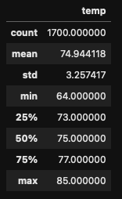
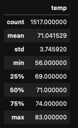
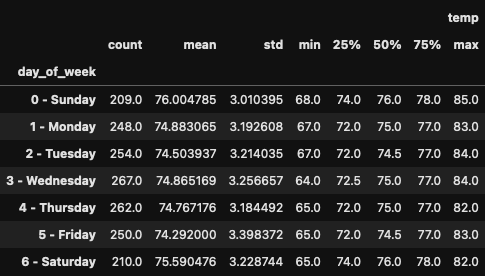
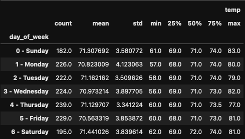

# surfs_up

## Overview 

Review June and December temperature data for Oahu, HI; determine whether a proposed surf-and-ice-cream business can be sustainable year-round. 

## Results

#### Descriptive Statistics for June & December

|    June     |   December  |
| ----------- | ----------- |
|  |  |

#### Key Differences Between June & December Weather

* While many of the statistics appear close, June's mean temperature is 3.9°F higher than December's, presenting a 5% increase in temperature. 
* Minimum temperatures are noticeably higher in June than in December, 64°F and 56°F, respectively. 
* Standard deviation in temperature is slightly higher in December than in June. Offhand, this hints that, on a day-to-day basis, there might be larger fluctuations in temperature in December. 

## Summary 

In addition to the above descriptive statistics, we also took a look at statistics for each day of the week in June and December. 

Unsurprisingly, June temperatures in Oahu, HU are - on the whole - slightly higher than temperatures in December. However, we consider these differences to be negligible, especially when looking at the data for each day of the week for these months. In particular, let's look at Saturdays and Sundays, which have the highest and second-highest mean temperatures at 71.4°F and 71.3°F, i.e. people are more likely to be off work, making these prime days for surfing _and_ ice-cream customers.

Additionally, these two high-profile surf competitions occur throughout December (and beyond).
* [Triple Crown of Surfing](https://en.wikipedia.org/wiki/Triple_Crown_of_Surfing)
* [The Eddie Aikau Big Wave Invitational](https://www.theeddieaikau.com/)

With the information available to us, we conclude that, **yes**, a surf-and-ice-cream business can indeed be sustainable year-round.

---

#### Descriptive Statistcs by Day of Week for June

---

#### Descriptive Statistcs by Day of Week for December

